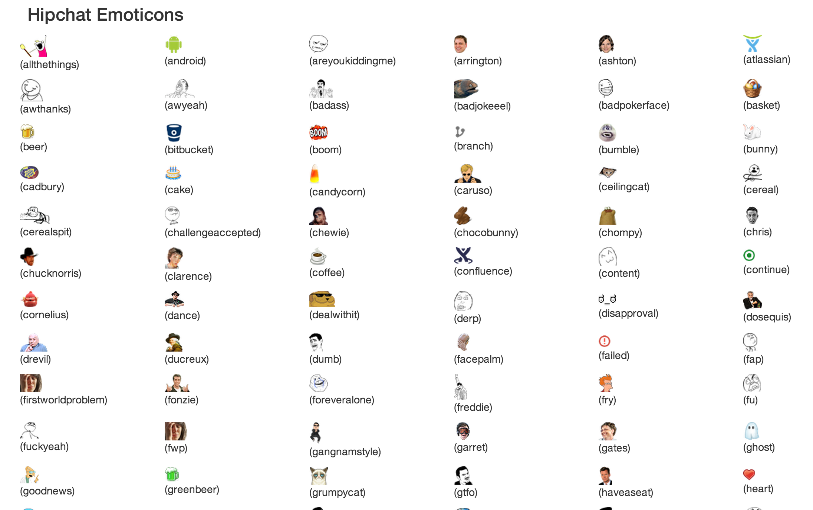

hipchat_emoticons
=================
This is a small node.js project that exercises [Hipchat](https://www.hipchat.com)'s new api for emoticons.

You will need to generate a token for Hipchat's beta api [here](https://www.hipchat.com/docs/apiv2)

To run locally, clone this project and then:

```
npm install
TOKEN=<your token> node app.js
```

If you want to deploy to heroku, you can execute this command after the initial setup:

```
heroku config:set TOKEN=<your token>
```

The webpage will show you all hipchat emoticons as well as your own emoticons:


